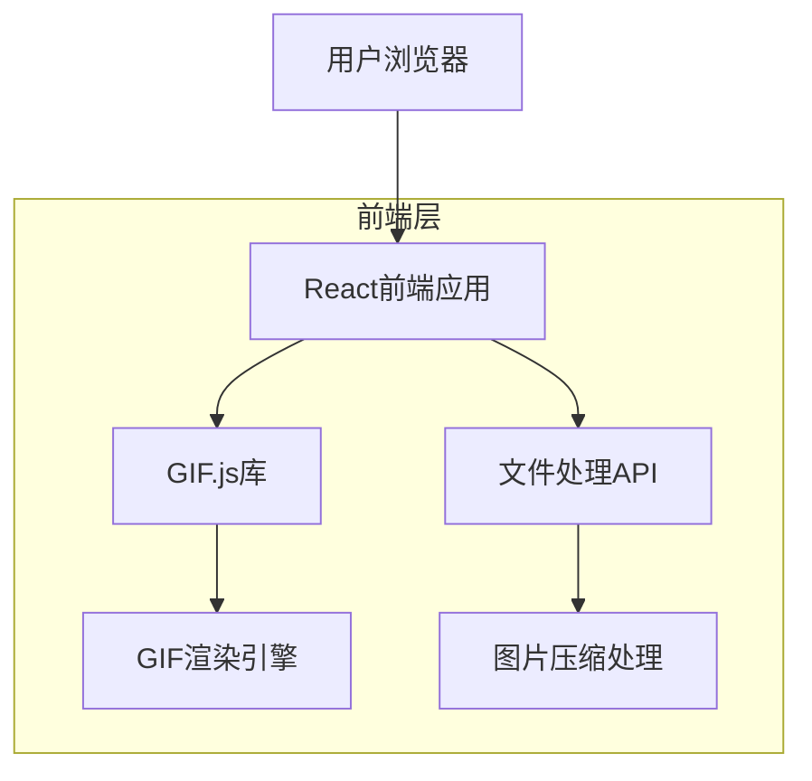
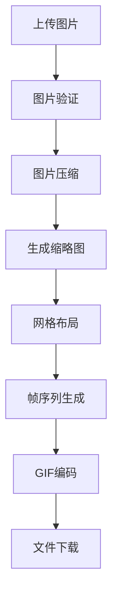

## 1. 架构设计



## 2. 技术描述

- **前端**: React@18 + tailwindcss@3 + vite
- **初始化工具**: vite-init
- **后端**: 无（纯前端实现）
- **核心库**: gif.js（GIF生成）、fabric.js（图片处理）

## 3. 路由定义

| 路由 | 用途 |
|-------|---------|
| / | 主页，包含GIF生成器所有功能 |

## 4. 组件架构

### 4.1 核心组件

**ImageUploader组件**
```typescript
interface ImageUploaderProps {
  onImagesLoaded: (images: File[]) => void;
  maxImages?: number;
  acceptedFormats?: string[];
}
```

**GIFPreview组件**
```typescript
interface GIFPreviewProps {
  frames: string[];
  duration: number;
  loopMode: 'once' | 'infinite' | 'count';
  direction: 'forward' | 'reverse' | 'pingpong';
  scale: number;
}
```

**ControlPanel组件**
```typescript
interface ControlPanelProps {
  rows: number;
  cols: number;
  duration: number;
  loopMode: string;
  direction: string;
  scale: number;
  onParameterChange: (params: GIFParameters) => void;
}

interface GIFParameters {
  rows: number;
  cols: number;
  duration: number;
  loopMode: 'once' | 'infinite' | 'count';
  direction: 'forward' | 'reverse' | 'pingpong';
  scale: number;
  loopCount?: number;
}
```

## 5. 状态管理

### 5.1 应用状态
```typescript
interface AppState {
  images: File[];
  previewFrames: string[];
  gifParameters: GIFParameters;
  isGenerating: boolean;
  generatedGIF: Blob | null;
}
```

### 5.2 图片处理流程


## 6. 性能优化

### 6.1 图片处理优化
- 使用Canvas API进行图片压缩和缩放
- 实现图片预加载机制
- 采用Web Worker处理大批量图片

### 6.2 GIF生成优化
- 帧间差异检测，减少重复数据
- 自适应调色板生成
- 渐进式加载和预览

## 7. 错误处理

### 7.1 错误类型
- 文件格式不支持
- 文件大小超限
- 内存不足
- 生成过程失败

### 7.2 用户提示
- 友好的错误信息展示
- 重试机制
- 降级处理方案